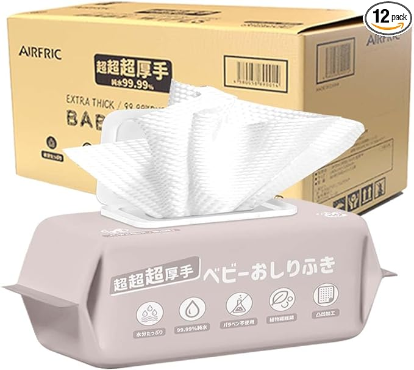
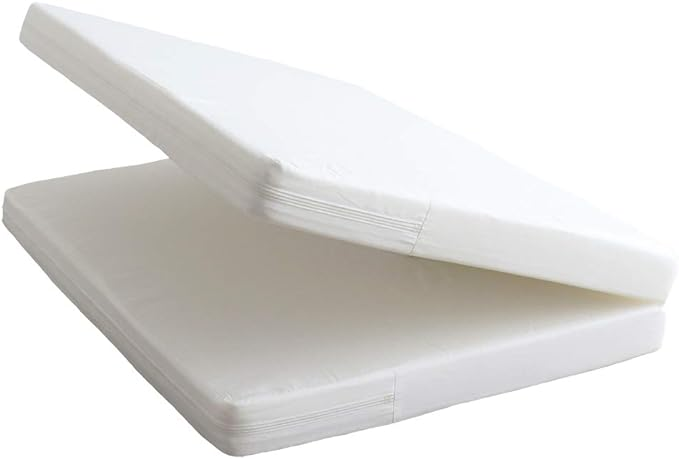
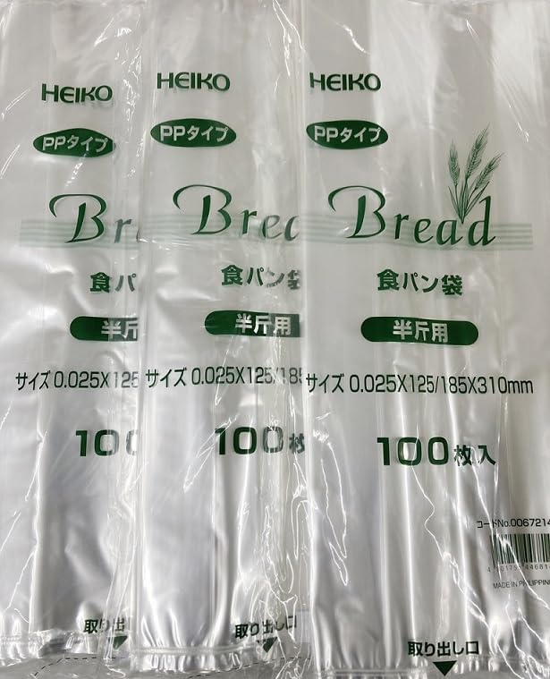
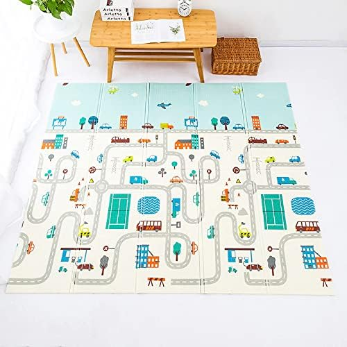
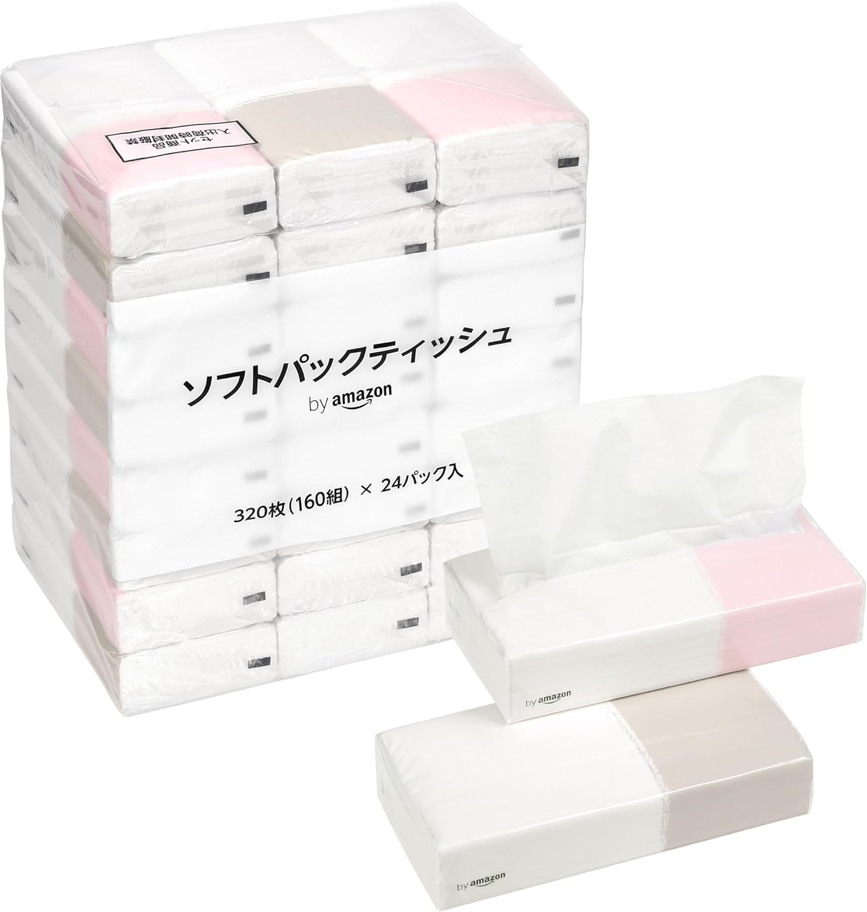

育児と家事を頑張る全てのパパ・ママに向けて、普段自分が利用していて日常をより便利にしてくれる素敵なアイテムを 4 つご紹介します！

これらのアイテムは、赤ちゃんのお世話から家事の効率化まで、様々なシーンで活躍します。ぜひチェックしてみてください。

## AIRFRIC Atsude シリーズ 赤ちゃん用おしりふき

### 商品概要
- 特徴: 超超超厚手、99.99%純水、ノンアルコール、無香料
- パッケージ: 80枚入り×12パック（960枚）
- 利点: 手やからだにも使える柔らかい不織布

### 使用例
このおしりふきは、厚手で1枚で済むので使い勝手が抜群です。また、ノンアルコールなので赤ちゃんの敏感な肌にも安心して使えます。外出時や食事後の手拭きにも最適です。

### メリットとデメリット
- メリット: 肌に優しく、使いやすい。大容量なので頻繁に購入する手間が省けます。
- デメリット: トイレに流せないので、その点は注意が必要です。

## HashkuDe ベビー 固綿敷布団

### 商品概要
- サイズ: 60×90×5cm
- 素材: ポリエステル65%、綿35%、中綿は固綿ポリエステル100%
- 利点: 高密度の綿で適度な硬さと弾力性

## 使用例
赤ちゃんの成長と安全を考えた設計で、未発達な背中をしっかり支えてくれます。

適度な硬さがあるので、うつ伏せになってしまった時でも窒息の危険を防げます。日本製で品質も安心です。

## メリットとデメリット
- メリット: 日本製で品質が高く、安全性も高い。ホルムアルデヒド検査済みで安心。
- デメリット: 洗濯がやや面倒。

## HEIKO PP食パン袋半斤用

## 商品概要
- 特徴: 300枚セット（100枚×3束）、おまけ付き
- 利点: におい防止機能付き、ポスト投函可能

## 使用例
におい防止機能が付いているので、替えた後のオムツの保管に最適です。大量セットなので、オムツが大量に消費される今の時期にぴったりです。

## メリットとデメリット
- メリット: 大量セットでコスパ良し。におい防止機能が便利。
- デメリット: 袋が大量なので、収納場所に困る場合がある。

## プレイマット 赤ちゃん ベビーマット

## 商品概要
- サイズ: 200×180×1cm、折り畳み可能
- 特徴: 防音、防水、安全素材、両面使用可能

## 使用例
広いリビングに敷いて、赤ちゃんが安全に遊べるスペースを提供してくれます。

防音機能付きで、子供が遊んでいても騒音を気にせずに過ごせるので賃貸の方にも安心です。

## メリットとデメリット
- メリット: 衝撃吸収バッファーが赤ちゃんを守り、安全な素材使用。多用途で便利。
- デメリット: 大きいので、収納時に場所を取る。

## by Amazon ソフトパックティッシュ

## 商品概要
- 原材料:バージンパルプ100%
- 梱包サイズ: 34.5×32×19.5㎝
- 原産国:中国

## 使用例
320枚160組(2枚重ね) x 24パック入の大容量ティッシュ

## メリットとデメリット
- メリット: 大容量のためコスパが良い
- デメリット: 大きいので、収納時に場所を取る。
