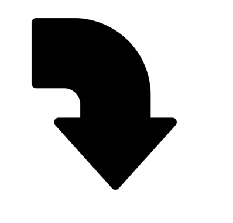
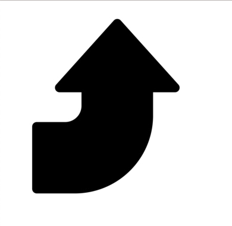
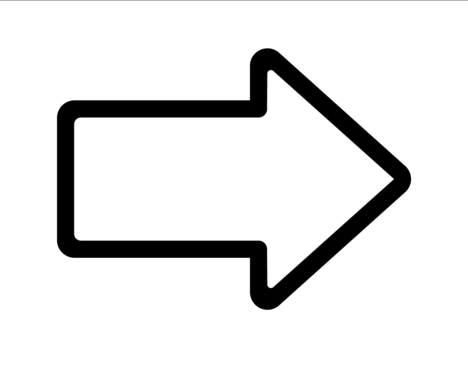
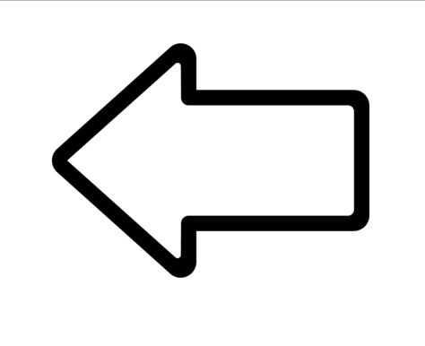
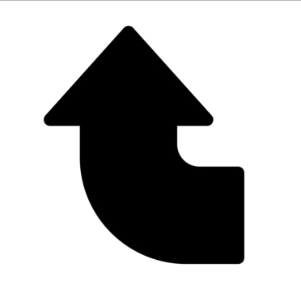

この記事では、画像を反転させる際にcssのみで完結する方法について詳しく解説します。

## transformプロパティのscale()で反転させる方法
コーディングの作業をしていると画像や要素を反転させたい時が出てくると思います。

そんな時に使えるcssが`transform`プロパティの`scale()`になります。

`scale()`を使用すると、以下のようなことが可能です。

- 画像を上下反転させる
- 画像を左右反転させる
- 画像を上下左右反転させる

それぞれ細かく見ていきましょう。

### 画像を上下反転させる

元画像


画像を上下反転させる場合は以下CSSを利用します。

```css
.reverse-y {
  transform: scale(1, -1);
}
```

CSS適用後


`scale()`の2つ目の数値に-1を指定することで上下が逆になります。

また、別の方法として

```css
.reverse-y {
  transform: scaleY(-1);
}
```

`scale()`を`scaleY()`として-1のみを指定する方法もあります。

どちらでも大丈夫なので、お好みで使い分けていただけるといいかなと思います。

### 画像を左右反転させる
次に左右反転させる方法です。

元画像


以下のCSSを利用します。

```css
.reverse-x {
  transform: scale(-1, 1);
}
```

CSS適用後


先ほどの上下を反転する時とは逆で、1つ目の数値に-1を指定することで左右が逆になります。

よって、`scale()`は`scale(左右の数値, 上下の数値)`となることがわかります。

また、左右を反転する別の方法として`scaleX(-1)`を利用する方法もあります。

```css
.reverse-x {
  transform: scaleX(-1);
}
```

### 画像を上下左右反転させる
次に上下左右に反転させる方法です。

元画像


上下左右反転させるには以下のCSSを利用します。

```css
.reverse-xy {
  transform: scale(-1, -1);
}
```

CSS適用後


ここまで記事を読んでいた方は薄々勘づいていたかもしれませんが、`scale()`の1つ目と2つ目の数値に-1を指定することで上下左右が反転となります。

また、`scaleX(-1)`と`scaleY(-1)`を両方指定しても上下左右反転をすることができます。

```css
.reverse-x {
  transform: scaleX(-1) scaleY(-1);
}
```

## transformプロパティのscale()とは
そもそもtransformプロパティのscale()とはどういう効果を持つものなのでしょうか？

簡単にいうとscale()関数は、画像や箱などのものを大きくしたり小さくしたりするためのものになります。

この関数を使うと、横にも縦にも、違う大きさで変えることができます。
例えば、横には2倍に、縦には3倍になどが可能です。

また、この関数を使うと、要素が画面の中で前に出てくるように見えたり、後ろに引っ込んでいくように見えたりすることもできます。

子供たちが遊ぶブロックやおもちゃを思い浮かべるとわかりやすいと思います。

ブロックを積み重ねて大きくしたり、広げて平らにしたりするのと同じようなことが、scale()関数でできるようになっています。
