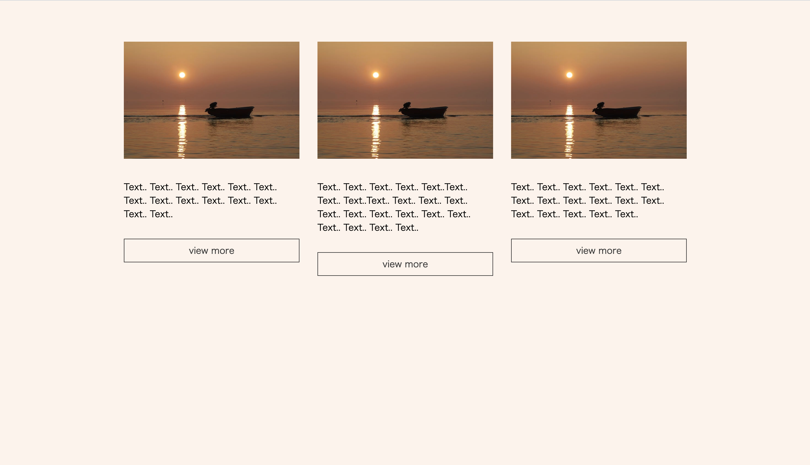
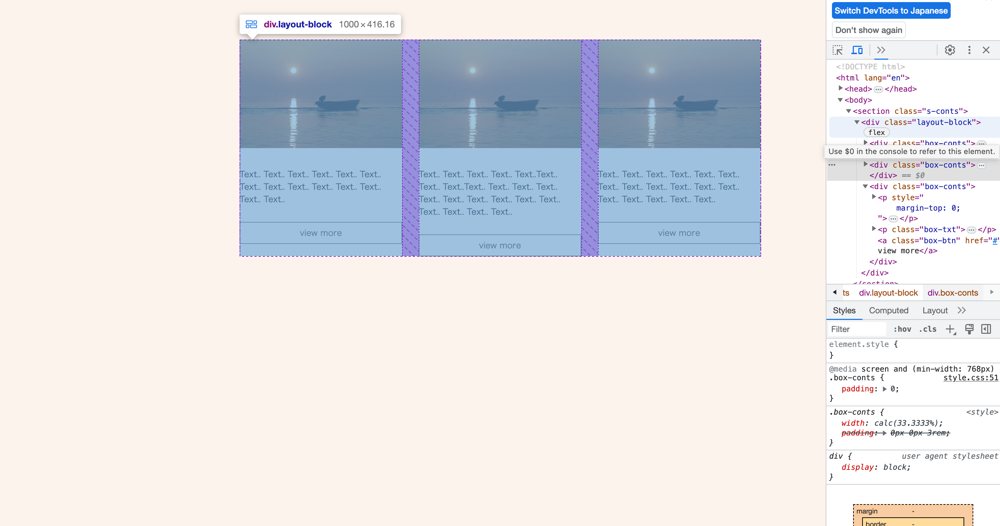
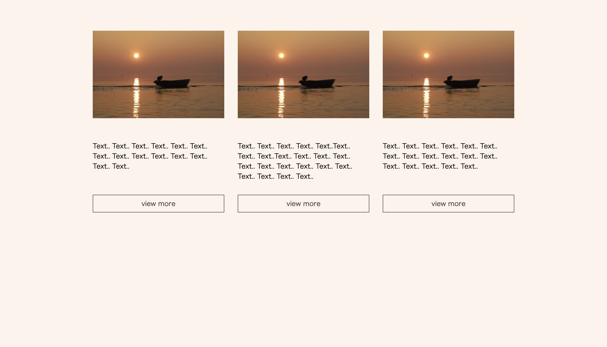
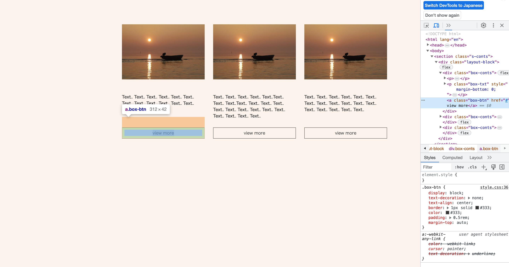
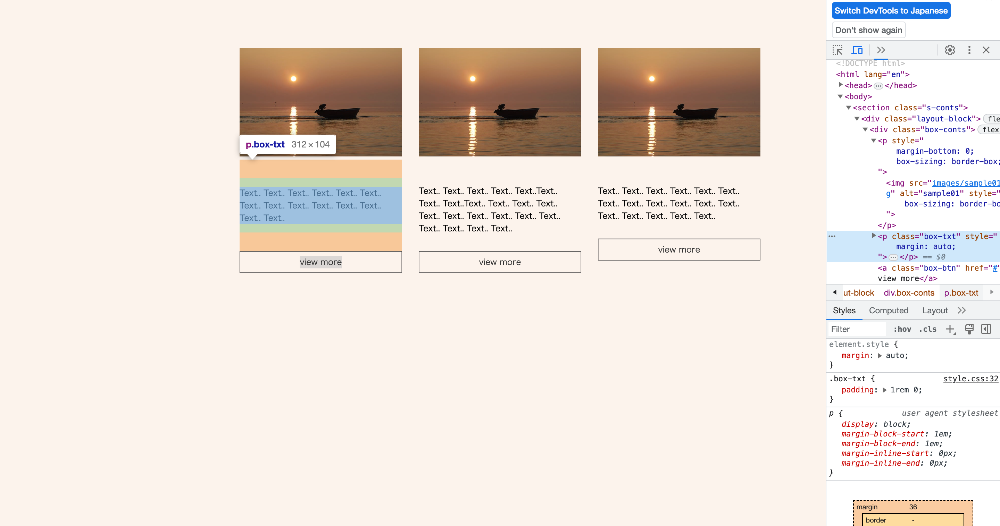

CSSのレイアウト構築において非常に便利なのがFlexboxです。特に横並びのレイアウトでよく利用され、要素同士が均等に高さが揃う特徴があります。

ただし、コンテンツの量によっては、横並びの要素同士の高さや見た目が揃わないことがあります。Webデザインにおいて、コンテンツ量の差異はよくあることであり、レスポンシブデザインの場合は要素の幅が可変であるため、高さも変化することがあります。

また、横並びのflexアイテムとして表示される子要素内には、複数の要素が配置されることがあり、そのために高さの揃いが難しい場合もあります。このような場合、適切に高さを調整する必要があります。

ここでは、具体例を挙げながら、横並び要素の見た目の高さを調整する方法を紹介します。

## flexアイテムの高さを適切に調整する

Flexboxを使用した簡単な横並びのレイアウトのサンプルを用意しました。まずはHTMLを見てみましょう。

**HTML**

```html
  <section class="s-conts">
    <div class="layout-block">
      <div class="box-conts">
        <p></p>
        <p class="box-txt">Text.. Text.. Text.. Text.. Text.. Text.. Text.. Text.. Text.. Text.. Text.. Text.. Text.. Text..</p>
        <a class="box-btn" href="#">view more</a>
      </div>

      <div class="box-conts">
        <p></p>
        <p class="box-txt">Text.. Text.. Text.. Text.. Text..Text.. Text.. Text..Text.. Text.. Text.. Text.. Text.. Text.. Text.. Text.. Text.. Text.. Text.. Text.. Text.. Text..</p>
        <a class="box-btn" href="#">view more</a>
      </div>

      <div class="box-conts">
        <p></p>
        <p class="box-txt">Text.. Text.. Text.. Text.. Text.. Text.. Text.. Text.. Text.. Text.. Text.. Text.. Text.. Text.. Text.. Text.. Text..</p>
        <a class="box-btn" href="#">view more</a>
      </div>
    </div>
  </section>
```
親要素のlayout-block内に、box-contsという子要素を配置します。この子要素にはサムネイル画像、テキスト、そしてリンクが含まれています。

次に、CSSの部分を見てみましょう。

**CSS**

```CSS
body {
  background-color: #fcf3ec;
}

main {
  padding: 0 4%;
}

.s-conts {
  max-width: 1000px;
  margin: 4% auto;
}

.layout-block {
  display: flex;
  justify-content: space-between;
  gap: 0 2rem;
  flex-direction:column;
}

.box-conts {
  padding: 0 0 3rem;
  width: calc(100% / 3);
}

.box-conts img {
  width: 100%;
}

.box-txt {
  padding: 1rem 0;
}

.box-btn {
  display: block;
  text-decoration: none;
  text-align: center;
  border: 1px solid #333;
  color: #333;
  padding: 0.5rem;
}

@media screen and (min-width:768px) {
  .layout-block {
    flex-direction: row;
  }

  .box-conts {
    padding: 0;
  }
}
```

親要素のlayout-blockを「display: flex;」とし、justify-contentプロパティを「space-between」として、flexアイテムの子要素を均等に配置、gapプロパティで余白と「2rem」つけました。

親要素を「display: flex;」とするだけで、子要素はflexアイテムとなり、flex-directionでflexコンテナの主軸の方向を変更しなければ、子要素は横並びになります。

キレイに表示させていくには、横並びの要素の高さを揃えていきたいところ。
ただ、子要素内のコンテンツの量によっては、見た目の高さが揃わないこともあります。



flexアイテムとしては、子要素の高さはしっかりと揃っています。



子要素ないのコンテンツ量に合わせて、横並びの要素と高さを揃える場合は、子要素もflexコンテナとして、子要素内のコンテンツの配置を調整していくことになります。

以下、追加記述箇所です。

**CSS**

```CSS
.box-conts {
  display: flex; /* 追加 */
  flex-direction: column; /* 追加 */
  padding: 0 0 3rem;
}

.box-btn {
  display: block;
  text-decoration: none;
  text-align: center;
  border: 1px solid #333;
  color: #333;
  padding: 0.5rem;
  margin-top: auto; /* 追加 */
}
```

対象の要素であるbox-contsに対して、display: flex;とflex-direction: column;を適用しました。これにより、要素内のコンテンツが縦方向に配置されます。また、box-btnにはmargin-top: auto;を設定することで、ボタンが要素内の一番下に配置されるように調整しました。

表示を確認すると、ボタンの配置が調整されたのが確認できます。



margin-topプロパティを「auto」とすることで、ボタン上の余白を自動で調整してくれるので、要素の1番下に配置されます。



また、コンテンツ内のテキストコンテンツでも、「margin: auto;」などを指定すると、横並びの要素と上下中央で揃えていくこともできます。



要するに、marginで余白を調整することができるということです。

今までのコードをまとめたものがこちら。

**HTML**
```HTML
  <section class="s-conts">
    <div class="layout-block">
      <div class="box-conts">
        <p></p>
        <p class="box-txt">Text.. Text.. Text.. Text.. Text.. Text.. Text.. Text.. Text.. Text.. Text.. Text.. Text.. Text..</p>
        <a class="box-btn" href="#">view more</a>
      </div>

      <div class="box-conts">
        <p></p>
        <p class="box-txt">Text.. Text.. Text.. Text.. Text..Text.. Text.. Text..Text.. Text.. Text.. Text.. Text.. Text.. Text.. Text.. Text.. Text.. Text.. Text.. Text.. Text..</p>
        <a class="box-btn" href="#">view more</a>
      </div>

      <div class="box-conts">
        <p></p>
        <p class="box-txt">Text.. Text.. Text.. Text.. Text.. Text.. Text.. Text.. Text.. Text.. Text.. Text.. Text.. Text.. Text.. Text.. Text..</p>
        <a class="box-btn" href="#">view more</a>
      </div>
    </div>
  </section>
```

**CSS**
```CSS
body {
  background-color: #fcf3ec;
}

main {
  padding: 0 4%;
}

.s-conts {
  max-width: 1000px;
  margin: 4% auto;
}

.layout-block {
  display: flex;
  justify-content: space-between;
  gap: 0 2rem;
  flex-direction:column;
}

.box-conts {
  display: flex; /* 追加 */
  flex-direction: column; /* 追加 */
  padding: 0 0 3rem;
  width: calc(100% / 3);
}

.box-conts img {
  width: 100%;
}

.box-txt {
  padding: 1rem 0;
}

.box-btn {
  display: block;
  text-decoration: none;
  text-align: center;
  border: 1px solid #333;
  color: #333;
  padding: 0.5rem;
  margin-top: auto; /* 追加 */
}

@media screen and (min-width:768px) {
  .layout-block {
    flex-direction: row;
  }

  .box-conts {
    padding: 0;
  }
}
```

Flexboxの概念はレイアウト構築にとても便利です。
flex-directionプロパティでの横並びや縦並び、justify-contentプロパティでの要素の配置や間隔のほか、よく利用するmarginプロパティも使うと、今まで以上に自由にレイアウトが調整することができるでしょう。
