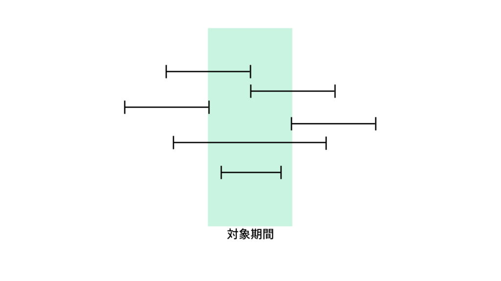
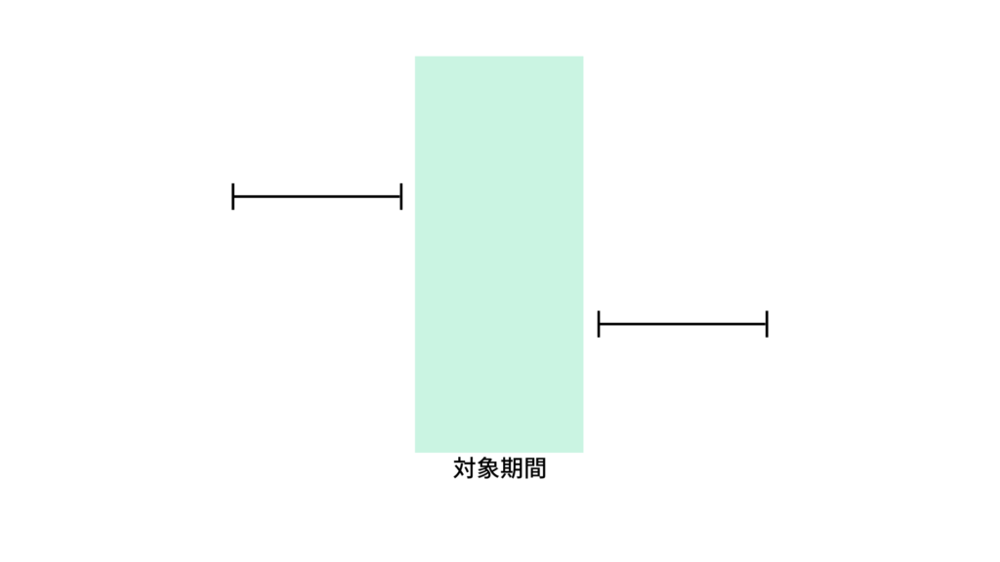

## Laravelとは


Laravelとは、2011年にリリースされた比較的新しいVMCモデルのフレームワークです。比較的新しいながら、PHPにおけるフレームワークの中では、代表的なフレームワークとなっています。

## 基本的な考え方
基本的には以下の考えで重複期間は取得できます。

`検索開始日付 <= 対象終了日付 AND 検索終了日付 >= 対象開始日付`



## Laravelでの検索期間と重複した期間を持つデータを取得する条件
以下の二つについて解説します。

- 開始日、終了日が決まっている場合
- 終了日が不定の状態が考えられる場合

### 開始日、終了日が決まっている場合
開始日と終了日が定まっている場合には基本に基づき、以下のqueryで検索期間内のデータを取得できます。

***$start_date***が検索条件の開始日時で、***$end_date***が検索条件の終了日時です。

```php
$duplication_date = $this
->where(function ($q) use ($start_date, $end_date) {
   $q->where('sample_start_date', '<=', $end_date)
   ->where('sample_end_datee', '>=', $start_date)
})
->get();
```

### 終了日が不定の状態が考えられる場合
終了日に不定の場合がある場合は以下のqueryで取得できます。

$start_dateが検索条件の開始日時で、$end_dateが検索条件の終了日時です。

```php
if ($end_date) {
  $duplication_count = $this
  ->where(function ($q) use ($start_date, $end_date) {
      $q->where('sample_start_date', '<=', $end_date)
      ->where('sample_end_date', '>=', $start_date)
      ->orWhere(function ($q) use ($end_date) {
          $q->where('sample_end_datee', null)
          ->where('sample_start_date', '<=', $end_date);
      });
  });
} else {
  $duplication_count = $this
  ->where(function ($q) use ($start_date) {
      $q->where('sample_end_datee', null)
          ->orWhere('sample_end_date', '>=', $start_date);
  });
}
```

両方とも日付の条件のみなので、実際に使用する場合は必要な条件を付けくわえてください。

## おまけ 検索期間外のデータを取得する条件
検索期間外のデータを取得する条件は以下になります。

`検索開始日付 > 対象終了日付 OR 検索終了日付 < 対象開始日付`



```php
$duplication_date = $this
->where(function ($q) use ($start_date, $end_date) {
   $q->where('sample_start_date', '>', $end_date)
   ->where('sample_end_datee', '<', $start_date)
})
->get();
```

## まとめ

いかがでしたでしょうか！

自分が実装を行う際に条件がどうなるのか迷った箇所だったので、備忘録としての役割も兼ねてまとめてみました！
