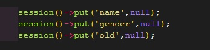
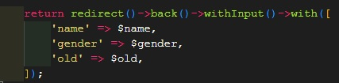

## Laravelとは


Laravelとは、2011年にリリースされた比較的新しいVMCモデルのフレームワークです。比較的新しいながら、PHPにおけるフレームワークの中では、代表的なフレームワークとなっています。

## はまった原因
更新ページの初期表示時にsessionで初期値を渡していたことが原因でした…



sessionを使用する際は初期値が必要と思っていたのですが、そうではなかったみたいです。



redirectの処理はミスなく記載していたんですけどね…。

## Laravelでのredirectの基本

以下にLaravelでのredirectの基本をまとめておくのでぜひ参考にしてください！

### 基本

```php
// httpの場合
return redirect('sample/show');                 // http://xxxxx/sample/show
return redirect()->to('sample/index');           // ↑と同義
return redirect('sample/show', 301);            // ステータスコードを指定する場合（※ デフォルトは、302）
return redirect('sample/show', 301, ['test-header' => 'サンプル'] ); // HTTPヘッダー を追加する場合

// httpsの場合
return redirect('sample/show', 302, [], true);  // https://xxxxx/sample/show

// ルート名での指定
return redirect()->route('sample.list');
return redirect()->route('sample.edit', ['sample_id' => 99]);      // sample_id情報を含むルーティングの場合（例： test/{sample_id} ）
$sample_id= Auth::user()->sample_id;                               // ↑と同義
return redirect()->route('test.show', ['sample_id' => $sample_id]);


// コントローラ名での指定
return redirect()->action('SampleController@show');
return redirect()->action('SampleController@edit', ['sample_id' => 99]);    // id情報を含む場合
```

### with関数で変数も一緒に

```php
return redirect('home')->with('result', '完了');
return redirect('home')->with(compact('members'));//compact使用時
return redirect('home')->with([       // 複数データを格納する場合は、配列で！
    'result_1'=>'成功-1',　//文字列直接格納
    'result_2'=>$result_2,　//変数格納
]);
```

blade側では
```php
{{ session('result_1') }}
```
で取得可能

### 登録処理や更新処理失敗時（直前のページに戻す）

```php
// データも一緒に、直前ページに戻す場合
public function back() {
    return back()->with('result', 'ok！');
}

// 例
public function back(Request $request) {
    return back()->withInput();
}
```

withInput関数を使用すれば前のページから送信されたデータがsession内に格納されます。

ブレードで使用する際は以下のように記載します。
```php
<input name="mail" value="{{ old('mail') }}">
```

## まとめ

いかがでしたでしょうか！

今回のミスのおかげで個人の勉強にもなり、一石二鳥でした笑
解決までにめっちゃ悩んだけど、解決してみたらそーでもない原因だった。なんてことよくあるのは自分だけではないはず…
