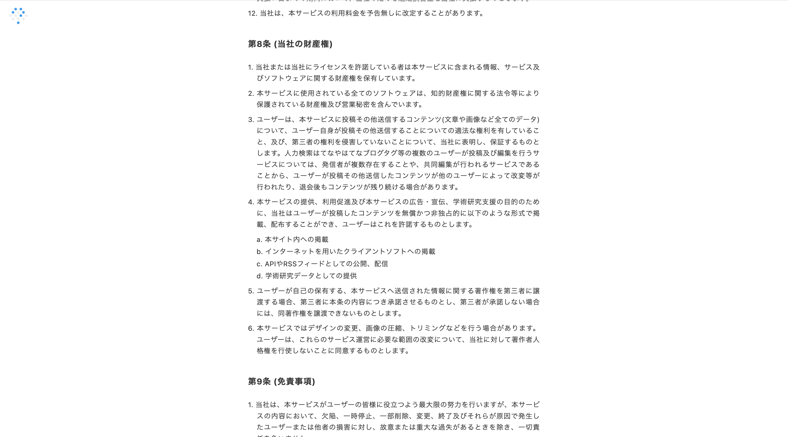

この記事ではブログを開設する際の選択肢について解説しています。

## 結論
結論をお話しすると下記のようになります。

### WordPressを利用して自分でブログサイトを作成する方法がおすすめな人
- ブログで収益化を考えている方
- 自分オリジナルのブログを持ちたいと思っている方
- 自分でドメイン名を決めたい方

### サービスとして提供されているブログがおすすめな人
- ただ記事を書いて他の人に色々なことを知ってほしい人
- 無料でブログを始めたい人
- 記事を書くことに集中したい人

### 自分でプログラムを書いてブログサイトを作成する方法がおすすめな人
- Webエンジニアになりたいと思っている人
- アウトプットをしたいと思っている人

詳しくみていきましょう！

近年ブログで収入を得る「アフィリエイト」という言葉をよく目にするようになってきました。

この記事を読んでいただいているあなたも、アフィリエイトで不労収入を得て将来的に楽になりたい！と思いブログを始めてみようとされているのではないでしょうか？

もしくは、自分が持っている知識を他の人にも教えたい広めたいという思いを持たれているかもしれません。

しかし、いざブログを開設しようと思い開設方法を調べるとごまんと開設方法に関する記事が出てきて「結局どれがいいの？」となってしまい結局開設できていないという状態になったことはありませんか？

そんなあなたに、普段ITに関わらない方でもブログを開設する際に目的に応じてどの開設方法が良いかをお教えします！

## ブログを開設する方法
ブログを開設する方法について、私が知る限りでも下記3パターンほどあります。

- ①サービスとして提供されているブログを利用する
- ②WordPressを利用して自分でブログサイトを作成する
- ③自分でプログラムを書いてブログサイトを作成する

## ①サービスとして提供されているブログを利用する
サービスとして提供されているブログとして例えば、下記のようなものが挙げられます。

- はてなブログ
- Amebaブログ
- note
- FC2ブログ

他にもたくさんありますが、どれも効いたことある名前だと思います。

### サービスとして提供されているブログを利用するメリット
このサービスとして提供されているブログを利用するメリットとして下記が挙げられます。

- アカウント登録のみで簡単にブログが開設できる
- 費用がかからない
- スマホからでも記事を投稿しやすい

#### アカウント登録のみで簡単にブログが開設できる
Webの知識があまりない方でも、アカウント登録をするだけで簡単に自分のブログが開設できます。

例えば、「②WordPressを利用して自分でブログサイトを作成する」や「③自分でプログラムを書いてブログサイトを作成する」ではドメインと呼ばれるものやサーバーの契約等の作業が発生しますが、この方法だとアカウント登録のみですぐにブログを書き始めることができます。

よって、収益化やカスタマイズを求めておらずすぐにブログを書き始めたいという方に向いている方法になります。

#### 費用がかからない
ドメイン代やサーバー代などをサービスを運営している会社が負担するので0円でブログを書き始めることができます。

#### スマホからでも記事を投稿しやすい
サービスとして提供されているブログはアプリ等を利用してスマホから記事を投稿できるものがほとんどとなってます。

アプリを用意しているサービスがほとんどなので、パソコンがなくても記事の投稿が可能となってます。

外出先でネタを見つけて記事を書き写真等と一緒に投稿することがスムーズにできるので、旅行系や日記系のブログを運営する際に便利になります。

### サービスとして提供されているブログを利用するデメリット
もちろんデメリットも存在します。

- サービスが突然終了する場合がある
- 色々な制限がかかるため自由度が低い
- 収益化をしにくい
- 書いた記事の著作権は自分につくが、サービス運営会社も記事を自由に使える

#### サービスが突然終了する場合がある
サービスとして運営されているので、収益を上げないと運営を行なっている会社の判断で突然運営終了となる場合があります。

過去には、Yahoo! JAPANの「Yahoo!ブログ」等の有名どころのブログサービスも終了していたりします。

たとえ大手が運営しているブログサービスでも突然終了するリスクは0ではないので、利用する場合には普段からバックアップをとっておくことが大切になります。

#### 色々な制限がかかるため自由度が低い
サービスとして提供されているブログでは、テンプレートの種類は充実しているサービスも多いですが、カスタマイズに制限がかかっていたり、そもそもカスタマイズできないようになっていたりします。

そのため、あくまでもサービスの枠内でのデザイン変更になり、細かい部分のカスタマイズが行えません。

また、サービスのヘッダー等が自動的に入るようになっていたりと、どうしてもブログの見た目を思い通りにすることが難しいです。

「デザインを自由に変更したい」「デザインにこだわりはないけどヘッダーが気になる」という方には、大きなデメリットになることが予想されます。

簡単にいうと「①サービスとして提供されているブログ」と「②WordPressを利用して自分でブログサイトを作成する」や「③自分でプログラムを書いてブログサイトを作成する」には、賃貸と持ち家のような違いがあると思ってもらえるとわかりやすいかと思います。

#### 収益化をしにくい
サービスとして提供されているブログのなかには、ブログ内に運営側の広告が強制的に掲載される仕組みになっているところや、利用規約内で制限を設けているサービスがあり広告を自由に掲載できないため収益化がしづらいです。

利用規約への違反があると運営会社の判断次第でブログごと削除されるリスクもあるので、事前の確認が必要となってきます。

たとえば、サービスとして提供されているブログであることを理由にASPの登録ができなかったり、広告掲載の審査に通らなかったりすることもあります。

#### 書いた記事の著作権は自分につくが、サービス運営会社も記事を自由に使える
例えばはてなブログの利用規約を見ると

引用：[はてなブログの利用規約](https://policies.hatena.ne.jp/rule#rule08)

著作権はブログを投稿した人にあるけど、ブログサービスの会社も自由に使っていいことにするよ。文句は言わないでね。というスタンスをとっています。

他のサービスとして提供されているブログもほとんど同じ場合が多いです。

## ②WordPressを利用して自分でブログサイトを作成する
次にWordPressを利用して自分でブログサイトを作成する方法についてです。

こちらの方法では簡単に言うとご自身でドメインとレンタルサーバーを契約していただき、自分でカスタマイズしたWordPress製のブログをネット上に公開するという方法になります。

収益化や自由度を考えたときに、個人的には一番バランスが良い方法だと考えています。

### WordPressを利用して自分でブログサイトを作成するメリット
メリットとしては下記が挙げられます。

- 自由度が高い
- ①の方法と比較して収益化が狙いやすい
- サービス終了などの影響を回避できる
- Googleアドセンスの審査が通りやすい

#### 自由度が高い
WordPressを利用することで、かなり自由度が高くなります。

WordPressでは個別に設定できる要素が多岐に渡るため、細部までこだわって設定すると、どこにも同じデザインが存在しないあなただけのオリジナルのサイトを作成することができます。

さらに、プラグインというものを使えば機能の追加も簡単に行えるため、「お問い合わせフォーム」等の本来は作成するのが難しい機能でも直感的な操作で導入することが可能です。

#### ①の方法と比較して収益化が狙いやすい
①の方法だと、サービスを運営している会社の利用規約に従う必要があったり、サービスを運営している会社が広告を貼っていたりすることにより収益化が難しいものとなっています。

しかし、WordPressでは自由に広告掲載ができるため、ブログで収益化を考えている人にとっては大事なポイントになります。

①の方法でも広告掲載が可能なものもありますが、クリック報酬型の定番である「Googleアドセンス」の審査に通りにくくなります。また、アフィリエイトでも一部広告に制限が掛けられるなど、自由度は低めです。

#### サービス終了などの影響を回避できる
ブログを運営しているのが自分自身なので、ランニングコストの元手とやる気さえ無くならなければ永遠に続けることが可能です。

#### Googleアドセンスの審査が通りやすい
独自ドメインを使えるようになるため、①の方法と比べてGoogleアドセンスの審査が通りやすくなります。

### WordPressを利用して自分でブログサイトを作成するデメリット
WordPressを利用して自分でブログサイトを作成するのデメリットとしては下記が挙げられます。

- 費用がかかる
- ブログを書き始めるまでに時間がかかる

#### 費用がかかる
自分自身で環境を用意しないといけないため、月数百円〜1000円弱くらいの費用がかかってきます。

人によっては苦しい金額になる方もいらっしゃるかと思います。

そんなかたはまず①の方法から始めてもらって、余裕ができたら②の方法に移行するというのをお勧めします！

#### ブログを書き始めるまでに時間がかかる
①の方法だと、10分~15分くらいあれば記事を書き始めることができますが、WordPressを利用すると初期設定等を行う必要があるため早くても数時間かかります。

## ③自分でプログラムを書いてブログサイトを作成する
こちらの方法はWeb制作の勉強をされている方向けの方法なので、ブログを書く＆プログラムの勉強をしたい人向けの方法となってます。

アクセス解析ツール（Google Analytics等）を導入する方法もWordPressを利用していればIDのコピペだけで済みますが、こちらではより実践的な方法をお教えすることができます。

何の言語を勉強したいか等で行う作業が変わったりするので、もし興味のある方がいらっしゃればお問い合わせフォームかX(旧Twitter)のDMで連絡をいただければと思います。

[お問い合わせフォーム](https://youta-ms.online/contact)

## まとめ
いろいろみてみましたが、目的に応じて最適な方法があります。

### WordPressを利用して自分でブログサイトを作成する方法がおすすめな人
- ブログで収益化を考えている方
- 自分オリジナルのブログを持ちたいと思っている方
- 自分でドメイン名を決めたい方

### サービスとして提供されているブログがおすすめな人
- ただ記事を書いて他の人に色々なことを知ってほしい人
- 無料でブログを始めたい人
- 記事を書くことに集中したい人

### 自分でプログラムを書いてブログサイトを作成する方法がおすすめな人
- Webエンジニアになりたいと思っている人
- アウトプットをしたいと思っている人
