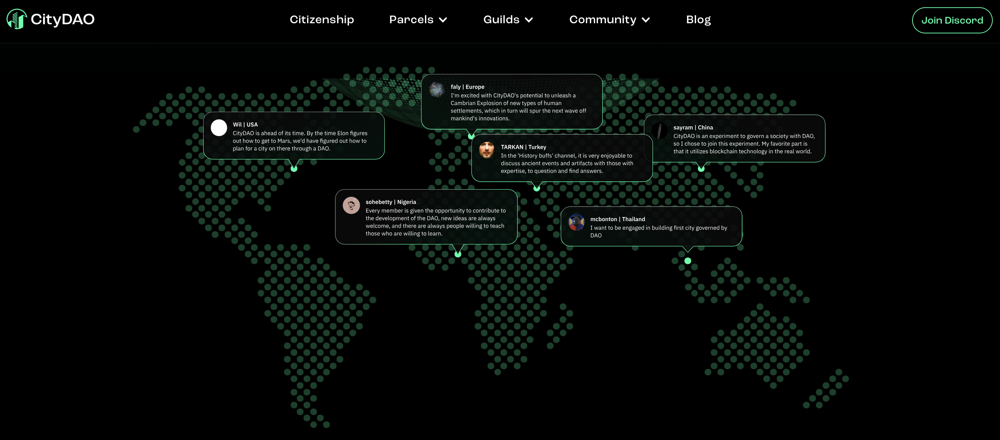
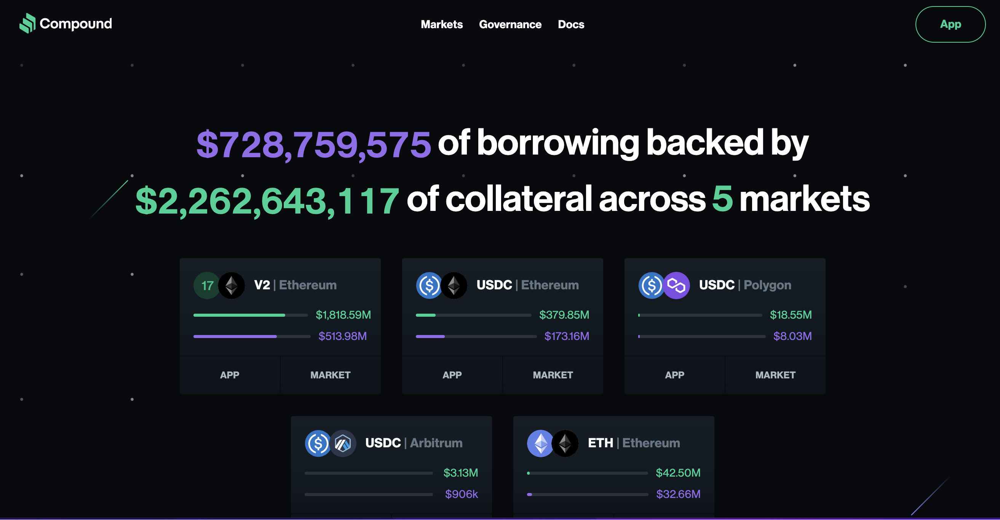
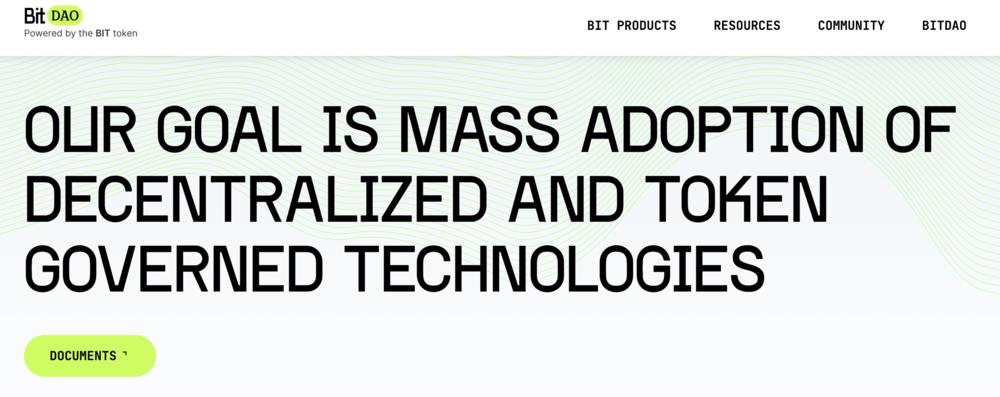
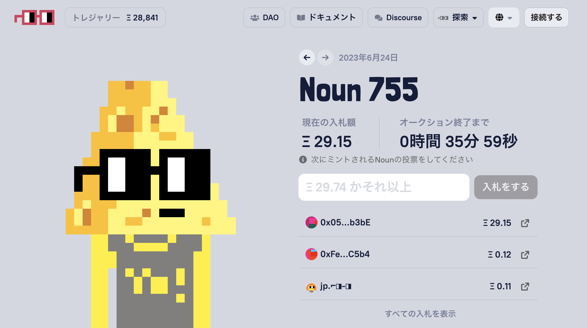

初めて仮想通貨やブロックチェーンについて聞いたとき、あなたは「DAO」という言葉に出会ったことはありませんか？この記事では、分かりやすい言葉で、DAO（Decentralized Autonomous Organization）について解説します。

## DAOって何？

DAOとは、特定の所有者や管理者が存在せず、それにもかかわらず事業やプロジェクトを推進できる組織を指す言葉です。正式名称は「Decentralized Autonomous Organization（分散型自律組織）」で、略してDAOと呼ばれています。

このDAOは、通常の株式会社などとは根本的に異なり、特にWeb3.0が進化する現代において注目されている組織形態です。分かりやすく言うと、DAOは組織を運営するために、一つの中心的な所有者やボスがいない、自律的なシステムとして機能します。

有名なDAOの例として、ビットコイン（BTC）が挙げられます。ビットコインは、特定のリーダーが存在しないにもかかわらず、世界中のマイナーと呼ばれる人々によるマイニング活動によってブロックチェーンネットワークが維持・管理されています。その結果、BTCの時価総額は約50兆円に達し、非常に成功したプロジェクトと見なされています。

さらに、2022年10月には、NFTコレクション「Moonbirds（ムーンバーズ）」を運営するPROOFが、Twitter上で「Moonbirds DAO」を2023年から本格的に開始する計画を発表し、大きな注目を集めました。

この記事では、初心者の方にも理解しやすく、DAOの特徴、メリット、デメリット、歴史などについて詳しく解説していきます。

[Web3.0についてはこちら](/web3/what_is_web3)

## DAOの特徴

これまでの内容から、DAOの基本概念と伝統的な組織との違いについて理解いただけたことと思います。

ここでは、より具体的なDAOの特徴について詳しく説明します。DAOには、主に以下の4つの特徴があります。

- 中央管理者の不在
- ガバナンストークンによる投票
- 高い透明性
- 所有権の分散

### 中央管理者の不在
DAOは中央のリーダーが存在しない組織です。つまり、特定の人が組織を支配することはありません。代わりに、コミュニティメンバー全体の合意（投票）によって方針が決まります。

### ガバナンストークンによる投票
DAOの運営方針や決定事項は、コミュニティメンバーが持つガバナンストークンを使って投票で決まります。このトークンを持っている人が組織の意思決定に参加できる仕組みです。

### 高い透明性
DAOの運営はブロックチェーン上で透明に記録されます。投票の結果や会話の内容は誰でも確認でき、不正行為を防ぎます。コミュニケーションは通常、Discordなどのプラットフォームを通じて行われ、その履歴もアクセス可能です。

### 所有権の分散
DAOでは、組織の所有権を分散させる考え方が重要です。これは、株式会社における株主の所有権に似ています。ガバナンストークンは、組織への貢献度に応じて分配されます。これにより、所有権が一部の人々に集中することが防がれます。

このような特徴により、DAOは透明性と分散された意思決定プロセスを提供し、個々のメンバーが価値を共有し、組織を共同で運営することが可能です。また、現在ではイーサリアムブロックチェーンとスマートコントラクト技術が活用され、さまざまな文脈でDAOが展開されています。

## DAOの実例

代表的なDAOの一例として、前述のビットコイン（BTC）やMakerDAOのほかにも、以下の5つのプロジェクトを紹介します。

- CityDAO
- Compound Grants（Compound Finance）
- BitDAO
- Nouns DAO
- PleasrDAO

### CityDAO

CityDAOは、デジタル都市を構築するプロジェクトで、ブロックチェーン上で土地の証明書がNFTとして販売されています。NFTを購入したユーザーはその土地の「市民」となり、さまざまな事象に投票できます。

2021年9月には、CityDAOはNFTの収益を元にワイオミング州の土地を共同購入し、そのガバナンスをメンバーによって行っています。

### Compound Grants（Compound Finance）

Compoundは、2018年にイーサリアムのブロックチェーン上に登場した代表的なレンディングプラットフォームです。そして、「Compound Grants」はCompoundと関連するDAOの名前です。

Compoundでは、ユーザー同士がスマートコントラクトを通じて暗号資産を貸し借りすることができます。資産を提供するユーザーは、一定期間の後に利息を受け取ることができます。

Compound Grantsは、Compoundのガバナンストークン「COMP」の保有者から成り立っており、流動性を高めるためのアイデアやイベントの開催など、Compoundの成長を支援する活動を行っています。

### BitDAO

BitDAOは、シンガポール拠点の暗号資産取引所「Bybit」が主導するDAOプロジェクトです。2021年6月に設立され、DeFi（分散型金融）プロジェクトの開発を支援しています。

BitDAOはガバナンストークン「Bit」を発行し、組織の運営に関する問題はBitトークン保有者たちによる投票で決定されます。2022年4月には、NFTアート収集を目的とする「PleasrDAO」に650万ドルの出資を行い、注目を浴びました。

### Nouns DAO

Nouns（ナウンズ）は、32×32ピクセルのドット絵をモチーフにしたNFTアートのシリーズです。Nounsはスマートコントラクトによって自動生成され、オークションに掛けられます。

Nouns DAOは、Nounsのエコシステムを管理する組織で、運営や財政についてはメンバーの投票によって決定されます。1体のNounsに対して1票の投票権が与えられ、Nounsを多く所有するメンバーの意見が尊重されます。

### PleasrDAO
PleasrDAOは、NFTの共同購入を目的とするDAOで、2021年3月に設立されました。高額なNFTを共同購入し、その価値が高まった際に利益を分配することが目的です。

PleasrDAOはこれまで、Uniswapが作成したNFTを約5,900万円で購入し、エドワード・スノーデン氏のNFTを約6億円で落札するなど、話題を集めてきました。

## まとめ

分散型自律組織（DAO）は、中央集権的な組織とは異なる新しいスタイルの組織です。誰でも参加して意見を出し、自動的なルールで運営され、ブロックチェーンの透明性を持っています。コミュニティや投資など、さまざまな場面で活躍しています。今後も注目です！

